# 9ledger Backend Design
### Accounting Module Architecture — Implementation Reference

> **Status**: Authoritative architecture document. Supersedes `AccountingArchitecture.md`.
> Last updated: 2026-02-21

---

## Contents

1. [Architecture Principles](#1-architecture-principles)
2. [System Architecture Overview](#2-system-architecture-overview)
3. [The Three-Step Workflow: Technical Enforcement](#3-the-three-step-workflow-technical-enforcement)
4. [Backend Module Structure](#4-backend-module-structure)
5. [Core Module Definitions](#5-core-module-definitions)
   - [Module Tiers](#module-tiers)
   - **Tier 1 — Legally Mandatory Core**
   - 5.1 [General Ledger (GL)](#51-general-ledger-gl)
   - 5.2 [Accounts Payable (AP)](#52-accounts-payable-ap)
   - 5.3 [Accounts Receivable (AR)](#53-accounts-receivable-ar)
   - 5.4 [Fixed Assets](#54-fixed-assets)
   - 5.5 [Tax & VAT / NAV Compliance](#55-tax--vat--nav-compliance)
   - 5.6 [Bank & Cash](#56-bank--cash)
   - **Tier 2 — Purchasable Extensions**
   - 5.7 [Inventory](#57-inventory-tier-2-extension)
6. [Draft Data Model and Audit Trail](#6-draft-data-model-and-audit-trail)
7. [Subledger-to-GL Reconciliation](#7-subledger-to-gl-reconciliation)
8. [Frontend Architecture: Unified UI, Separated Backend](#8-frontend-architecture-unified-ui-separated-backend)
9. [Security, RBAC, and Compliance](#9-security-rbac-and-compliance)
10. [Period Close Procedure](#10-period-close-procedure)
11. [Scalability and Extensibility](#11-scalability-and-extensibility)

---

## 1. Architecture Principles

Three rules govern the entire accounting backend. Every design decision in this document is a consequence of one or more of these rules.

**Rule 1 — One GL, many domain services.**
There is a single General Ledger as the authoritative record of all financial activity. All submodules (AP, AR, Fixed Assets, Inventory, Tax, Bank) are domain services that post *into* the GL through a centralized `AccountingService`. They never share a database table with each other and they never bypass the service interface to write directly to the GL.

**Rule 2 — The GL never reads back into domains.**
The `AccountingService` and the GL data model have no dependency on AP, AR, Inventory, Fixed Assets, or any other transaction module. The dependency goes one way: transaction modules depend on `AccountingService`. `AccountingService` depends on nothing except the GL data model. This creates a clean, testable dependency graph and allows every submodule to evolve independently without risk of breaking the ledger.

This rule must be enforced at the project structure level. In a .NET solution, `Accounting.Core` has no `ProjectReference` to `Accounting.AP`, `Accounting.Inventory`, or any other submodule project. A CI pipeline check (a custom Roslyn analyzer or a project graph assertion) must break the build if this rule is violated.

**Rule 3 — The UI is a routing shell, not a business logic layer.**
The React frontend presents a unified entry point where users select an economic event type. That selection determines which backend API module is called and which form component is loaded. No business logic, validation, or accounting rules live in the frontend. The frontend is entirely driven by what the API returns.

These three rules together produce Option A: **unified UI, separated backend submodules, unified GL**.

---

## 2. System Architecture Overview

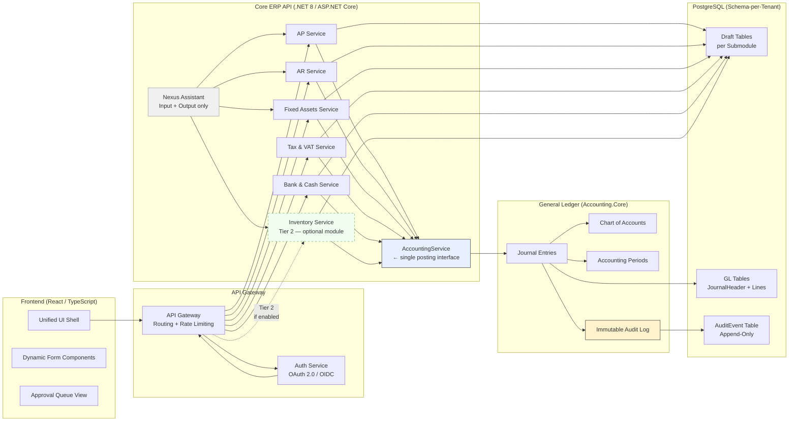

**Key structural notes:**

- Nexus Assistant has a service identity with `DataEntry` role permissions. It can write to draft endpoints only. It has no route to approval endpoints.
- The API Gateway enforces rate limiting and routes requests. It does not contain business logic.
- Each tenant gets its own PostgreSQL schema. Within that schema, each submodule has its own draft tables. GL tables are shared across submodules but written to only via `AccountingService`.
- The `AuditEvent` table is append-only. No `UPDATE` or `DELETE` is permitted on it at the database privilege level.

---

## 3. The Three-Step Workflow: Technical Enforcement

The 3-step workflow is not a UI pattern — it is a state machine enforced at every layer of the stack: database schema, API endpoints, RBAC, and service contracts.

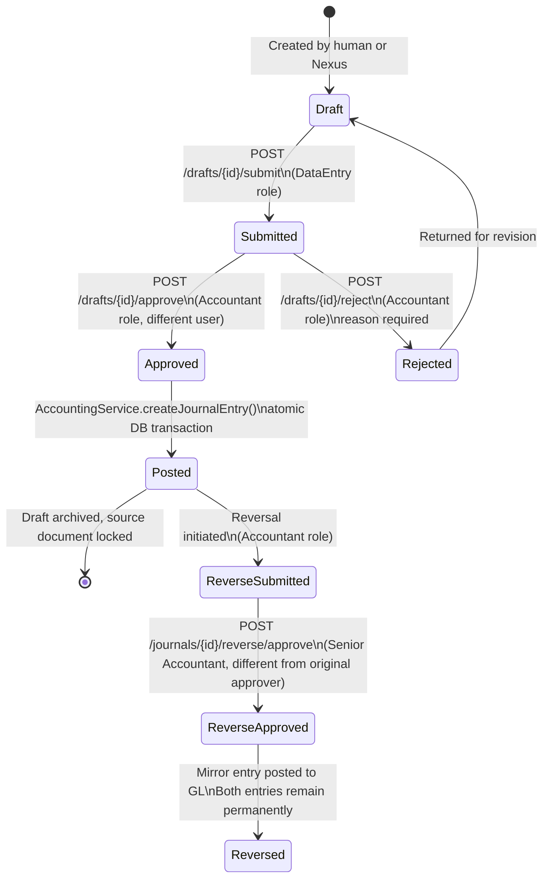

### Step 1 — Input

- Every submodule exposes a `POST /{module}/drafts` endpoint, accessible to users with `DataEntry` role or higher.
- The draft entity is mutable while in `draft` or `rejected` status.
- Every field populated or modified by Nexus is tagged with `nexus_suggested: true` at the *field level*, stored as a metadata map alongside the draft record. This is not a UI annotation — it persists in the database.
- Nexus also records the `classification_rule_id` and `classification_rule_version` that determined the event type and account code suggestions. These are immutable once written.
- The draft holds a `row_version` integer for optimistic concurrency control. Any write to a draft must supply the current `row_version`; a mismatch returns `409 Conflict`.

### Step 2 — Specialist Check

- Submission (`POST /drafts/{id}/submit`) transitions the draft to `submitted`. The `submitted_by` and `submitted_at` fields are set and thereafter immutable.
- The approval endpoint (`POST /drafts/{id}/approve`) is gated behind the `Accountant` role in RBAC.
- **Segregation of duties** is enforced server-side: if `approved_by == submitted_by`, the request is rejected with `403 Forbidden`. This check cannot be bypassed from the frontend.
- The approval payload must include a non-empty `approval_comment`. Empty strings are rejected.
- Before posting, the submodule's approval handler runs **module-specific validation** (described per module in Section 5). Generic `AccountingService` validation (balanced entry, open period, valid accounts) runs after that.
- Rejection requires a `rejection_reason` from a controlled vocabulary (classification error, insufficient documentation, policy violation, duplicate entry, other). Free text is also accepted as a supplemental field.
- A rejected draft returns to `draft` status and can be revised and resubmitted.

### Step 3 — Output

- On approval, the submodule service calls `AccountingService.createJournalEntry()` inside a single database transaction.
- If `createJournalEntry()` succeeds: the draft status is set to `archived`, the source document is locked (`is_posted = true`, `posted_at`, `posted_by` stamped), and the `JournalHeader` is created with `status = posted`.
- If `createJournalEntry()` fails: the entire transaction rolls back. The draft remains in `submitted` status. The error is logged as an `AuditEvent` entry. No partial state is written.
- The `JournalHeader` is immutable from the moment it is created. There is no edit endpoint for posted journal entries.
- All Output-stage reports, VAT extracts, dashboards, and NAV submissions read exclusively from `JournalHeader` records with `status = posted`. Draft or submitted data never appears in financial output.

### Reversal

- Reversals are initiated on a posted `JournalHeader` and go through their own approval cycle.
- The reversal approval must be performed by a user with `SeniorAccountant` or `CFO` role.
- The system enforces that the reversal approver is not the same user who approved the original posting.
- On approval, `AccountingService.reverseJournalEntry()` creates a mirrored entry with all debit and credit amounts switched. Both the original and the reversal entry remain permanently in the ledger. Neither is deletable.
- Reversals must carry a mandatory `reason_code` (Error, Correction, Period Reallocation, Cancellation, Regulatory Adjustment) and a free-text explanation.

---

## 4. Backend Module Structure

Each submodule is a bounded domain service. They are structurally independent of each other and communicate only through the `AccountingService` interface.

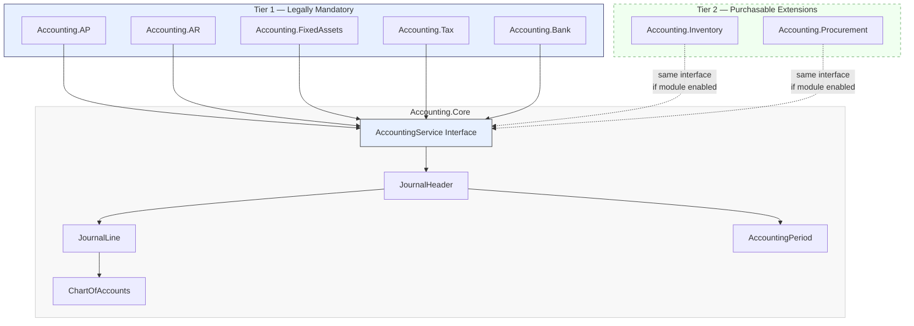

**Each submodule contains:**

- Its own domain entity models (e.g., `VendorInvoice`, `AssetRegisterEntry`, `StockMovement`)
- Its own `DraftEntry` extension (base fields + domain-specific fields)
- Its own approval validation handler (module-specific rules run before GL posting)
- Its own API controllers (Input and approval endpoints)
- Its own database tables within the tenant schema
- No direct database access to any other submodule's tables

**What submodules share:**

- The `AccountingService` interface from `Accounting.Core`
- The `DraftEntryBase` abstract model from `Accounting.Core`
- The `AuditEventLogger` from `Accounting.Core`
- RBAC primitives from the Auth Service

**What is absolutely forbidden:**

- A submodule importing from another submodule (AP must not reference AR models)
- A submodule writing directly to `JournalHeader` or `JournalLine` tables
- `Accounting.Core` importing from any submodule
- Any endpoint returning draft or unposted data in financial reports or dashboards

---

## 5. Core Module Definitions

### Module Tiers

Not all modules carry the same legal weight. The Hungarian Accounting Act and VAT law define a clear minimum set of records that every business must maintain. Modules beyond that minimum are commercially relevant but not universally legally required — and are correspondingly sold as separately purchasable extensions, consistent with how Microsoft Dynamics AX and RLB-60 structure their products.

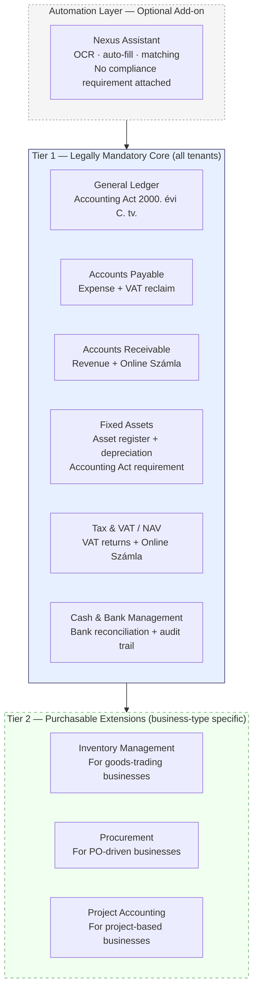

**Why Inventory is Tier 2:** A service business (consulting, software, accounting firm) has no stock. Inventory management is irrelevant and including it in the mandatory core would impose unnecessary complexity. For goods-trading businesses it is operationally essential, but the legal minimum for their GL is satisfied by a periodic physical-count adjustment entry — a full perpetual subledger is a business need, not a statutory one. This matches how both AX and RLB-60 position inventory as a separate purchasable component.

**Why Fixed Assets is Tier 1:** Unlike inventory, the Hungarian Accounting Act explicitly requires every business that capitalizes an asset to maintain a formal asset register (tárgyi eszköz nyilvántartás) with depreciation records. There is no equivalent statutory exemption. Any business that owns equipment, vehicles, or property must have this module.

**Nexus Assistant:** OCR extraction and auto-fill are product differentiators, not compliance requirements. A business is legally compliant whether invoice data is typed manually or pre-filled by automation. Nexus is always an optional layer on top of the compliant core.

---

### 5.1 General Ledger (GL)

The GL is the system of record. It is owned entirely by `Accounting.Core` and written to by no path other than `AccountingService`.

**Chart of Accounts (COA)**

The COA is a hierarchical, multi-level structure (Modified Preorder Tree Traversal — MPTT). Each account has:

- A unique account code within the company (e.g., Hungarian account plan codes: 1-9 top-level classes)
- An account type: Asset, Liability, Equity, Revenue, Expense
- A normal balance side: Debit (Asset, Expense) or Credit (Liability, Equity, Revenue)
- Active/inactive status — inactive accounts block new postings
- A flag for whether manual entries are permitted (some accounts accept only system-generated postings, e.g., accumulated depreciation)
- A parent account reference for hierarchy traversal

**Accounting Periods**

Periods are non-overlapping date ranges per company. A period exists in one of three states:

- `open` — postings accepted
- `closed` — postings blocked; can be reopened before locking
- `locked` — permanently immutable; no reopening permitted

The `AccountingService` auto-determines the appropriate period from the posting date. If the determined period is `closed` or `locked`, the posting is rejected before any write occurs.

**Journal Entry Structure**

A journal entry consists of a `JournalHeader` (the envelope) and two or more `JournalLine` records.

The `JournalHeader` records: source document type, source document ID, posting date, description, `status` (posted / reversed), `created_by`, `posted_by`, `posted_at`, and a reference to its reversal (if any).

Each `JournalLine` records: the account code, exactly one of debit amount or credit amount (never both, never neither), an optional description, and optional analytical dimensions (cost centre, project, department).

**Validation enforced by `AccountingService` before any write:**

- At least two lines per entry
- Total debits equal total credits (the balanced entry rule)
- All account codes exist, are active, and permit the type of entry being made
- The target period is open
- The source document reference is provided and non-null

**Balance Computation**

Account balances are always computed from posted `JournalLine` records. Draft lines are invisible to balance queries. For debit-normal accounts the balance is `sum(debits) - sum(credits)`. For credit-normal accounts it is `sum(credits) - sum(debits)`. Balances can be computed as of a specific date or for a specific period.

**The `AccountingService` Interface Contract**

The interface exposes three operations to submodules:

- `createJournalEntry` — accepts source document reference, posting date, description, journal lines, period (optional, auto-determined if absent), and the acting user. Returns the created `JournalHeader` or throws a typed exception.
- `reverseJournalEntry` — accepts the journal ID, reason code, reversal date, and the acting user. Returns the new reversal `JournalHeader`.
- `getAccountBalance` — accepts an account code and an optional as-of date. Returns a decimal balance.

No other public methods exist. Submodules cannot enumerate GL entries, cannot modify accounts, and cannot interact with period management directly.

---

### 5.2 Accounts Payable (AP)

AP owns the complete lifecycle of vendor invoices and vendor payments.

**What AP owns:**
- Vendor master data (name, VAT number, bank account, payment terms)
- Purchase invoices and credit notes (incoming)
- Payment runs and individual vendor payments
- AP subledger balance (sum of open vendor liabilities)
- AP aging report data

**GL posting derivation (system-generated, never manually entered):**

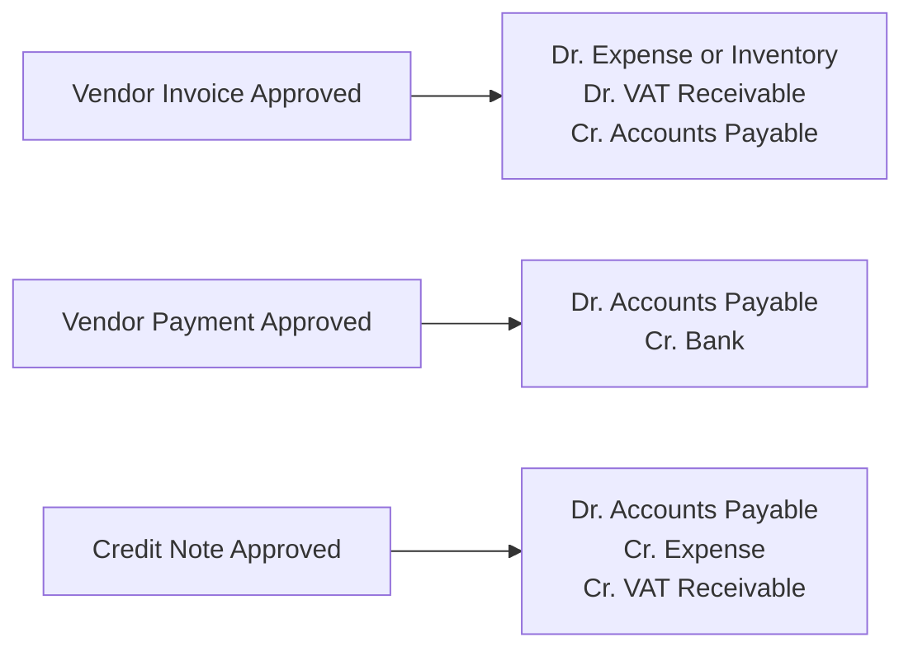

**Specialist Check validation rules (module-specific, run on AP approval):**
- Invoice must have a vendor reference (invoice number from vendor)
- Invoice date and due date must be present and logically consistent
- VAT code must be selected and valid
- If a Purchase Order exists for this vendor, 3-way match is checked: PO quantity ≥ goods received quantity ≥ invoiced quantity. A mismatch does not hard-block approval but generates a flagged warning that the approver must explicitly acknowledge.
- Duplicate invoice detection: same vendor, same invoice number, same amount within the last 12 months raises a blocking error.

**3-Way Match (AP + Procurement integration):**

The AP service checks for linked Purchase Orders and Goods Receipts. This is a read-only reference — AP reads PO and GR status from the Procurement and Inventory services via internal API calls. It does not share a database table with them. If no PO exists, the invoice proceeds as a direct purchase.

---

### 5.3 Accounts Receivable (AR)

AR owns the complete lifecycle of customer invoices, credit notes, and customer receipts.

**What AR owns:**
- Customer master data (name, VAT number, credit limit, payment terms)
- Sales invoices and credit notes (outgoing)
- Customer payment receipts and allocations (matching payments to open invoices)
- AR subledger balance (sum of open customer receivables)
- AR aging and dunning trigger data

**GL posting derivation:**

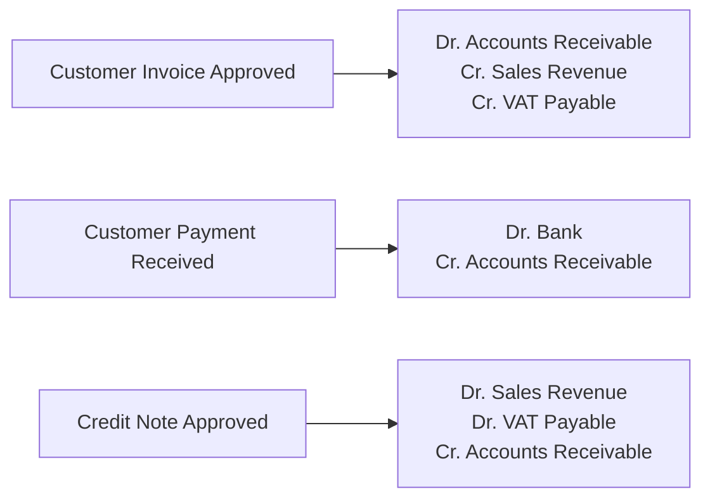

**Specialist Check validation rules:**
- Customer must exist and be active (not blocked for credit reasons)
- Invoice lines must reference valid revenue accounts
- VAT code must be applied correctly per customer type (domestic, EU, third-country)
- For invoices above the NAV Online Számla threshold, the Tax & VAT service confirms real-time reporting readiness before approval completes. Output cannot proceed until NAV submission receipt is obtained.

**Payment allocation:**
Customer payments are allocated to open invoices using a matching engine. Unallocated payments are held in a suspense account until matched. Partial allocations are supported. The allocation record links the payment `JournalHeader` to the invoice `JournalHeader` for full traceability.

---

### 5.4 Fixed Assets

Fixed Assets manages the entire lifecycle of long-term tangible and intangible assets, from acquisition through disposal.

**What Fixed Assets owns:**
- The asset register (one record per asset with cost, accumulated depreciation, net book value)
- Depreciation schedules (method, useful life, residual value)
- Asset lifecycle state machine
- Revaluation records
- Disposal records and gain/loss computation

**Asset lifecycle:**

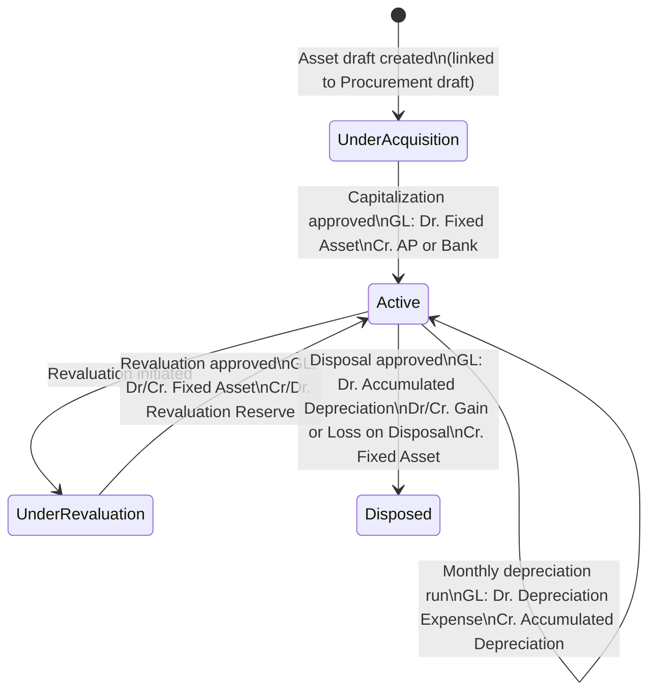

**Depreciation (auto-generated, not a manual journal):**
Depreciation is never entered as a manual accounting event. The Fixed Assets service runs a scheduled depreciation job (monthly, on period close initiation). For each active asset, it computes the period depreciation amount based on the chosen method (straight-line, declining balance, units of production) and calls `AccountingService.createJournalEntry()`. The source document reference is the asset register entry ID. No human approval is required for routine depreciation runs — these are system-generated entries under the authority of the period close approval.

**Specialist Check validation rules (for manual events — capitalization, disposal, revaluation):**
- Asset class must be selected (determines the GL account codes used)
- Useful life must be specified and positive
- Residual value must be ≥ 0 and < acquisition cost
- Disposal: proceeds amount must be present; gain/loss is computed automatically and shown to the approver for review before signing off

**Integration with Procurement:**
An asset acquisition draft in Fixed Assets can be linked to a Procurement draft for tracking market offers, emails, and supporting documents. Once the procurement is finalized and the vendor invoice is created in AP, the Fixed Assets service receives a completion signal and initiates the capitalization workflow. The procurement draft is archived; the asset register record moves from `UnderAcquisition` to pending capitalization approval.

**GL Account-Range Trigger (Fixed Asset Detection):**
When any GL posting — whether originating from AP, a manual journal entry, or Bank — debits an account code that falls within the configured fixed asset account range (e.g., accounts 1xx in the Hungarian Chart of Accounts), the system automatically detects this and triggers the asset registration flow. This detection happens inside the Fixed Assets service, which subscribes to a `JournalEntryPosted` domain event published by `AccountingService` after a successful post.

On detection, the user is presented with a contextual prompt (a non-blocking modal at the UI layer, or a workflow notification): *"This entry debits a fixed asset account. Would you like to register this as an asset?"* The user can:
- Accept and immediately complete an asset register entry (pre-filled with the GL amount, posting date, and vendor reference from the originating document)
- Defer, which creates a pending asset registration task visible in the Fixed Assets module
- Decline, which records a deliberate exemption reason (e.g., below capitalization threshold, expensed by policy)

This pattern ensures the asset register and the GL never drift apart through omission. It mirrors the RLB-60 workflow where capitalizing a fixed asset account automatically prompts asset module entry. The detection is based on account code ranges configured per company in the Chart of Accounts, so the system adapts to any customer's account plan without hard-coded assumptions.

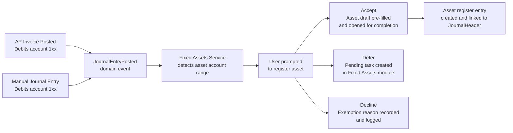

---

### 5.5 Tax & VAT / NAV Compliance

The Tax & VAT module is the compliance gateway for all tax-related obligations. It does not own business documents — it operates as a validation and reporting layer that cross-cuts AP, AR, and GL.

**What Tax & VAT owns:**
- Tax code master (VAT rate, tax category: standard, reduced, exempt, reverse-charge, intra-EU)
- VAT ledger (input VAT accumulation from AP, output VAT accumulation from AR)
- VAT return periods and return documents
- NAV reporting submission log (invoice-level records, submission receipts)
- Tax code applicability rules (by customer/vendor type, by product category, by transaction date)

**VAT flow:**

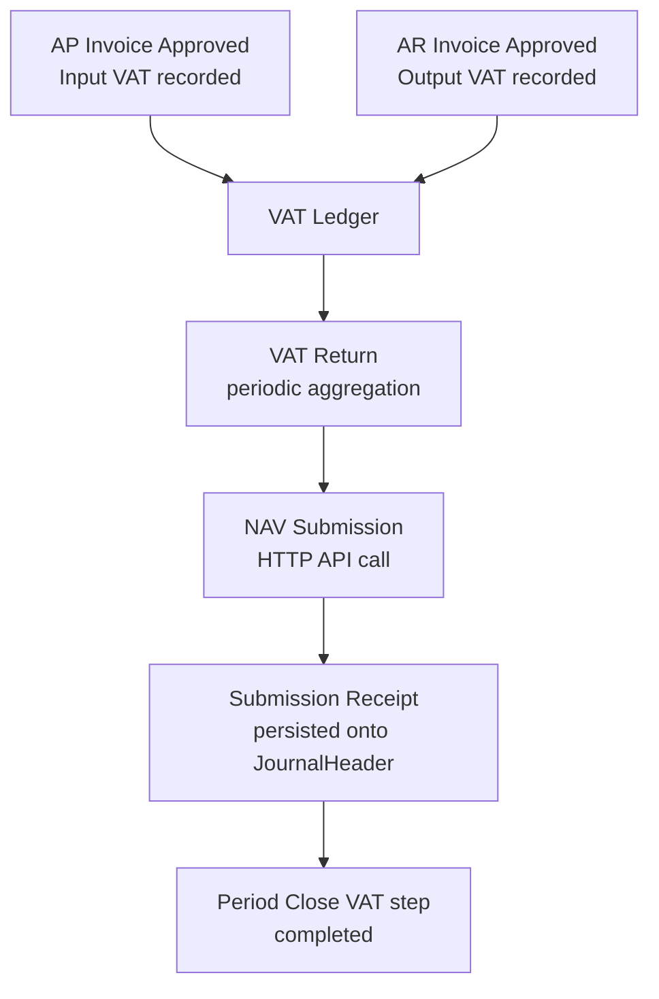

**Online Számla (NAV real-time reporting):**
For every outgoing customer invoice that meets or exceeds the legally defined threshold, the AR approval workflow triggers a call to the Tax & VAT service before the posting is completed. The Tax & VAT service formats and submits the invoice data to the NAV Online Számla API. The submission receipt (NAV acknowledgement token) is stored and linked to the invoice's `JournalHeader`. If the NAV API is unavailable or returns an error, the invoice approval is blocked until the submission succeeds. The AR service retries on a schedule; the invoice remains in `submitted` status during this window.

For invoices below the threshold, the data is queued for inclusion in the periodic VAT return, not submitted in real time.

**VAT Return:**
At the end of each VAT period, the Tax & VAT service aggregates input and output VAT from all posted journal entries in the period. The resulting return document requires `Accountant` approval before submission. The submission itself (M-sheet / electronic VAT return API) is handled by the Tax & VAT service and the receipt is stored. The VAT return submission is a mandatory step in the period close checklist.

**Specialist Check validation rules (on any transaction that carries a VAT code):**
- VAT code must match the vendor/customer registration type (domestic company, EU VAT-registered, non-EU)
- Reverse-charge transactions must have the counterpart VAT entry on both input and output VAT accounts
- Intra-EU acquisitions must trigger the appropriate self-assessed VAT entries
- If the VAT code carries a legal deadline (e.g., VAT reclaim eligibility window), a warning is raised when the invoice date approaches the limit

---

### 5.6 Bank & Cash

Bank & Cash manages the import, classification, and reconciliation of bank statement transactions.

**What Bank & Cash owns:**
- Bank account master (IBAN, bank name, currency, GL account mapping)
- Imported bank statement lines (raw data from OFX, CAMT.053, or direct banking API)
- Transaction classification records (linking a bank line to an AP payment, AR receipt, or GL account)
- Reconciliation status per statement line
- Cash movement journal entries

**Bank transaction lifecycle:**

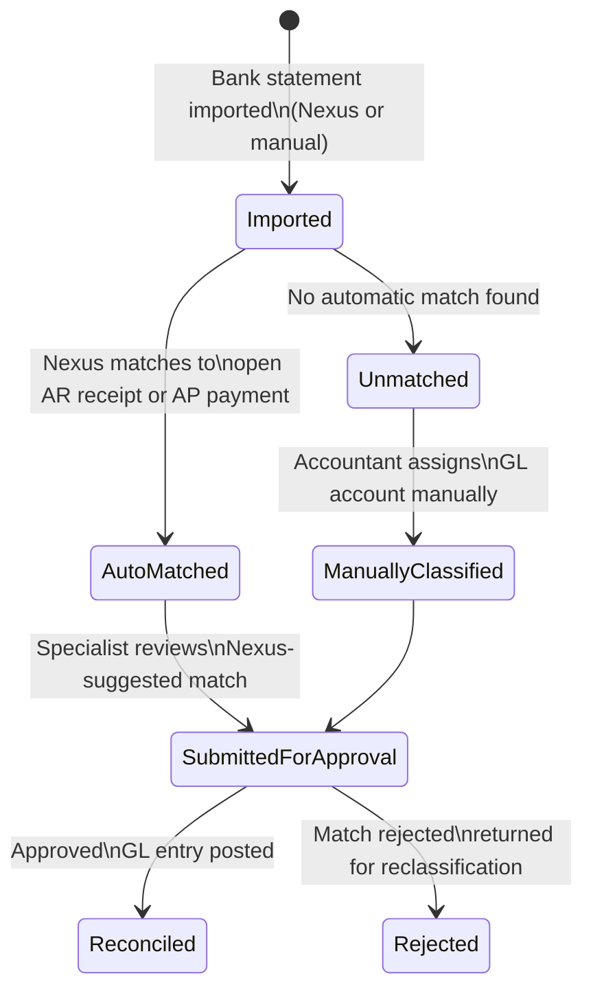

**GL posting derivation:**

A bank debit (money leaving the account):
- Dr. Accounts Payable (if matched to a vendor payment) / Dr. Expense (if direct classification)
- Cr. Bank

A bank credit (money entering the account):
- Dr. Bank
- Cr. Accounts Receivable (if matched to customer payment) / Cr. Revenue (if direct classification)

**Reconciliation:**
Every bank statement line must reach `reconciled` status before the period can be closed. Unreconciled lines are surfaced in the period close checklist as blocking items. A line can be reconciled (matched to a GL entry) or explicitly marked as `outstanding` with a documented reason (e.g., a cheque issued but not yet cleared). The outstanding status still requires approval before period close.

**Nexus role in Bank & Cash:**
Nexus performs automatic matching of bank lines to open AR and AP items based on amount, date proximity, and reference number. Every Nexus-suggested match is flagged as `nexus_suggested: true` and must pass through the Specialist Check before posting. Nexus does not post bank entries unilaterally.

---

### 5.7 Inventory *(Tier 2 Extension)*

> **This module is a separately purchasable extension.** It is required for goods-trading businesses but not for service businesses. Tenants without Inventory enabled use manual periodic stock adjustment entries posted directly through the GL. See [Module Tiers](#module-tiers) for the full rationale.

Inventory manages the quantity and valuation state of stock items. GL postings are side effects of warehouse movements — they are never entered manually.

**What Inventory owns:**
- Item master (SKU, description, unit of measure, valuation method)
- Stock locations and warehouse structure
- Stock movements (goods receipt, goods issue, internal transfer, write-off, physical count adjustment)
- Inventory subledger balance (total inventory value, reconciled against GL Inventory control account)
- Lot and batch traceability records

**Valuation and GL posting derivation:**

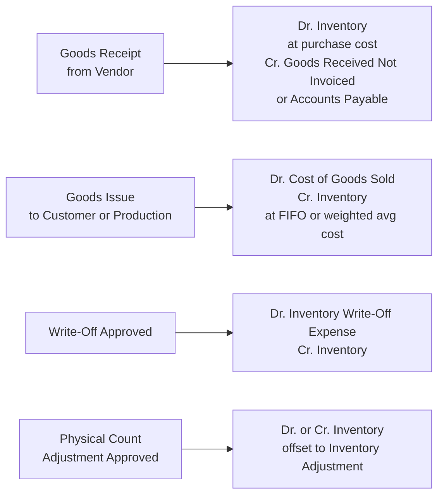

**Valuation method:**
The valuation method (FIFO or weighted average) is set at the item or item-category level and is immutable once inventory transactions have been posted for that item. Changing a valuation method requires a stock write-down to zero, a period close, and reconfiguration — a controlled administrative operation with mandatory approval.

The cost assigned to a goods issue is always computed by the Inventory service based on the valuation method. The GL line amounts are derived values — the approver sees the computed cost in the approval view and can reject if the cost appears anomalous, but cannot manually override the amount.

**Specialist Check validation rules:**
- Goods receipt: purchase order reference required if PO exists; quantity must not exceed PO line quantity unless a tolerance override is explicitly approved
- Write-off: mandatory reason code and written justification required; above a configurable monetary threshold, `SeniorAccountant` approval is required
- Physical count adjustment: must reference a completed physical count document; adjustments in both directions require approval

**Subledger balance integrity:**
The inventory subledger balance (sum of all inventory item values at any point in time) must equal the GL Inventory control account balance. This reconciliation is run daily and on period close (see Section 7).

**Note on Tier 2 activation:** When the Inventory module is not enabled for a tenant, the GL Inventory account is still available for manual postings (e.g., single periodic stock adjustment entries). The Tier 2 module adds the perpetual subledger, FIFO/weighted-average valuation, and detailed stock movement tracking on top of the base GL — it does not replace it.

---

## 6. Draft Data Model and Audit Trail

All submodule draft entities share a common base structure. Each submodule extends this base with its domain-specific fields.

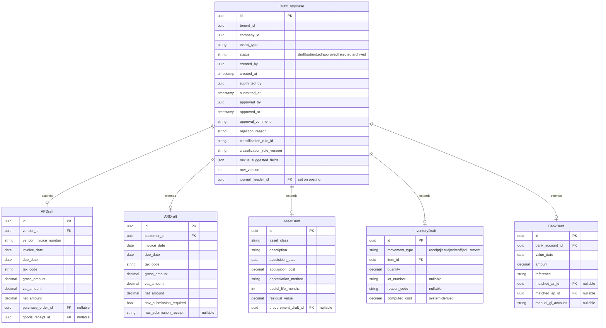

**Audit trail guarantees:**

- Every state transition on a `DraftEntry` (draft → submitted, submitted → approved, etc.) writes an `AuditEvent` record before the state change is committed. If the state change fails, the `AuditEvent` is also rolled back.
- The `AuditEvent` table is append-only. Database privileges for the application role exclude `UPDATE` and `DELETE` on this table.
- `AuditEvent` records: `id`, `tenant_id`, `entity_type`, `entity_id`, `action` (created, submitted, approved, rejected, posted, reversed, archived), `performed_by`, `performed_at`, `previous_state`, `new_state`, `metadata` (JSON — carries relevant field values at the time of the event).
- Archived drafts are never purged within the statutory retention period (7 years for Hungarian accounting records).

---

## 7. Subledger-to-GL Reconciliation

Every subledger (AP, AR, Inventory, Fixed Assets) maintains a running balance that must at all times match its corresponding GL control account balance. Discrepancies indicate a bug, an unauthorized manual GL entry, or a data integrity failure — all of which require immediate investigation.

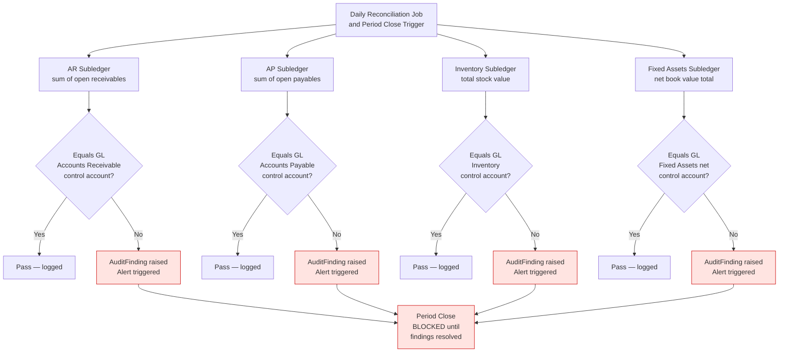

**Reconciliation records:**
Each reconciliation run produces a `ReconciliationResult` record: `run_at`, `period`, `subledger_balance`, `gl_control_balance`, `difference`, `status` (pass / fail), `finding_id` (if fail).

An `AuditFinding` record contains: `raised_at`, `raised_by` (system), `subledger_type`, `difference_amount`, `status` (open / under investigation / resolved), `resolution_note`, `resolved_by`, `resolved_at`.

Period close cannot proceed past step 3 (see Section 10) until all `AuditFinding` records for the period are in `resolved` status, confirmed by a `SeniorAccountant`.

---

## 8. Frontend Architecture: Unified UI, Separated Backend

The React frontend is a **routing shell**. It presents a unified user experience on top of entirely separated backend submodules. There is zero business logic in the frontend.

```mermaid
flowchart LR
    subgraph FE["React Frontend"]
        Portal[Accounting Portal\nUnified Entry Point]
        Dropdown[Event Type Dropdown]
        Router[Client Router]

        subgraph Forms["Dynamic Form Components"]
            APForm[AP Invoice Form]
            ARForm[AR Invoice Form]
            FAForm[Fixed Asset Form]
            INVForm[Inventory Movement Form]
            BankForm[Bank Classification Form]
            ManualForm[Manual Journal Entry Form]
        end

        AQ[Approval Queue View\nAggregated across all modules]
        NexusBadge[Nexus Field Indicator\nshown per flagged field]
    end

    subgraph API["Backend API Endpoints"]
        APEndpoint[POST /api/v1/ap/drafts]
        AREndpoint[POST /api/v1/ar/drafts]
        FAEndpoint[POST /api/v1/assets/drafts]
        INVEndpoint[POST /api/v1/inventory/drafts]
        BankEndpoint[POST /api/v1/bank/drafts]
        ManualEndpoint[POST /api/v1/gl/manual-entries]
        AQEndpoint[GET /api/v1/approval-queue\naggregates all modules]
        ApproveEndpoint[POST /api/v1/{module}/drafts/{id}/approve]
    end

    Portal --> Dropdown --> Router
    Router --> APForm --> APEndpoint
    Router --> ARForm --> AREndpoint
    Router --> FAForm --> FAEndpoint
    Router --> INVForm --> INVEndpoint
    Router --> BankForm --> BankEndpoint
    Router --> ManualForm --> ManualEndpoint

    AQ --> AQEndpoint
    AQ --> ApproveEndpoint
    APForm & ARForm & FAForm & INVForm & BankForm --> NexusBadge
```

**Key frontend design rules:**

**Event type routing:** When a user selects "Incoming Invoice" from the dropdown, the router loads the `APInvoiceForm` component and points its submit handler to `POST /api/v1/ap/drafts`. Selecting "Fixed Asset Registration" loads `FixedAssetForm` pointing to `POST /api/v1/assets/drafts`. The URL reflects the current context so that deep links and browser navigation work correctly.

**Nexus field flagging:** Every field in a form that was populated by Nexus is rendered with a distinct visual indicator (a small badge or highlighted border). The indicator is driven by the `nexus_suggested_fields` map returned by the API with the draft data — not by frontend logic. At the approval step, if any `nexus_suggested_fields` are present, the approval UI renders an explicit acknowledgement checkbox: *"I have independently verified all AI-suggested fields."* This checkbox is required before the approve action is enabled. This acknowledgement is transmitted to the backend and persisted on the approval record.

**Approval queue aggregation:** The `GET /api/v1/approval-queue` endpoint is a server-side aggregation that queries pending drafts from all submodule draft tables and returns them in a unified structure with a common schema. Each item carries an `event_type`, `module`, and `draft_id`. When the approver takes action, the frontend calls the module-specific approve/reject endpoint (e.g., `POST /api/v1/ap/drafts/{id}/approve`). The aggregation endpoint is read-only and never performs any business logic.

**No financial data in the frontend state:** The frontend never stores ledger balances, account codes, or draft financial data in localStorage or any persistent client-side store. All sensitive data lives in session-scoped state only and is cleared on logout. API calls always include the JWT bearer token validated by the Auth Service.

---

## 9. Security, RBAC, and Compliance

### Role Hierarchy

| Role | Permitted Actions |
|---|---|
| `DataEntry` | Create and edit drafts (own only). Submit drafts. Read own submitted drafts. |
| `Accountant` | All DataEntry actions. View all drafts across submodules. Approve and reject drafts (standard value threshold). Cannot approve own submissions. |
| `SeniorAccountant` | All Accountant actions. Approve high-value entries (above configurable threshold). Approve reversals. Initiate and confirm period close steps. |
| `CFO` | All SeniorAccountant actions. Approve period lock. View all financial reports. Approve system-level configuration changes (COA modifications, valuation method changes). |
| `Auditor` | Read-only access to all posted journal entries, all audit events, all archived drafts, all reconciliation results. No write access of any kind. |
| `NexusServiceAccount` | Write access to draft endpoints only. No access to approval, GL, or reporting endpoints. Explicitly excluded from `Accountant` role. |

Each role is enforced at the API endpoint level via RBAC middleware. The enforcement is server-side — frontend role checks are for UX only and are not trusted by the backend.

### Segregation of Duties

These rules are enforced in code, not just by policy:

| Rule | Enforcement |
|---|---|
| Submitter ≠ Approver | Approval endpoint compares `submitted_by` against the JWT `sub` claim. Returns `403` if they match. |
| Original Approver ≠ Reversal Approver | Reversal approval endpoint reads `approved_by` from the original `JournalHeader` and blocks if it matches the acting user. |
| High-value entries | Entries above the configurable threshold require `SeniorAccountant` or `CFO` role, checked at the approval endpoint. |
| COA modifications | Changes to the Chart of Accounts require `CFO` role and generate an `AuditEvent` with before/after state. |

### Immutable Audit Log

Every significant state change generates an `AuditEvent` record. The following actions always produce audit events: draft created, draft modified, draft submitted, draft approved, draft rejected, journal entry posted, journal entry reversed, period closed, period locked, account created or modified, role assignment changed, reconciliation run, reconciliation finding raised or resolved, NAV submission sent or failed.

The `AuditEvent` table is protected at the PostgreSQL level: the application database role has `INSERT` privilege only. `UPDATE` and `DELETE` are granted to no role except a dedicated, MFA-protected administrative account used only for legally required corrections (and which itself generates an administrative audit log in a separate system).

### Data Retention

Hungarian accounting law requires 7-year retention of accounting records. All posted `JournalHeader` and `JournalLine` records and their archived source drafts are subject to this retention policy. Deletion is blocked by the system for records within the retention window. After the retention window, soft-deletion is permitted only with `CFO` authorization and is logged.

GDPR compliance for personally identifiable data in accounting records (customer names, VAT numbers) is handled through pseudonymization of non-essential fields at the 7-year mark, while preserving the financial integrity of the ledger entries.

---

## 10. Period Close Procedure

Period close is an ordered, idempotent workflow. Each step must complete successfully before the next step begins. The `PeriodCloseChecklist` is a first-class database entity with one record per period.

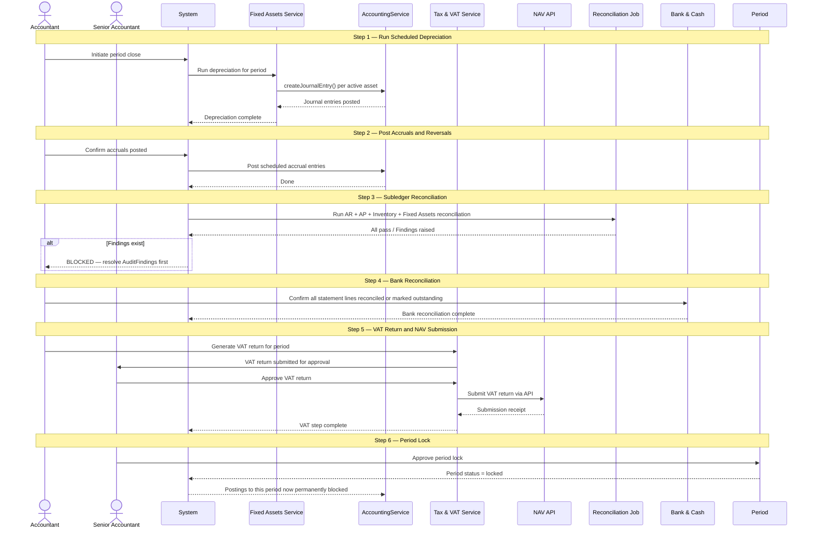

**Idempotency:** Each checklist step can be re-run if it failed, without risk of double-posting. The depreciation run checks whether depreciation entries for the period already exist before creating new ones. The reconciliation job is a read-only assertion and is always safe to repeat.

**The period lock is enforced inside `AccountingService.createJournalEntry()`**: the period status is checked immediately before any write. If the period is `locked`, the call throws `PeriodLockedError`. This check cannot be bypassed from any submodule or API endpoint.

---

## 11. Scalability and Extensibility

### Adding a New Module

The architecture is designed so that adding a new domain module (e.g., Procurement, Project Accounting, Payroll) requires no changes to `Accounting.Core` or the GL. The steps are:

1. Define the domain entity models in a new `Accounting.Procurement` project
2. Extend `DraftEntryBase` with procurement-specific fields
3. Implement module-specific approval validation rules
4. Call `AccountingService.createJournalEntry()` on approval — no GL knowledge needed in the new module
5. Add the module's draft table to the approval queue aggregation query
6. Expose the new API endpoints and link them to the frontend router

No existing module is modified. No GL schema is changed.

### Database Scaling

**Multi-tenancy:** Each tenant occupies a dedicated PostgreSQL schema. The application passes the schema name in the connection context. Tenant schemas are isolated — a query in Schema A cannot touch Schema B.

**Indexing strategy:** The most critical indices for accounting performance are on `JournalLine.account_code` (for balance queries), `JournalLine.journal_header_id` (for entry retrieval), `JournalHeader.posting_date` (for period filtering), `JournalHeader.status` (for filtering posted-only entries), and `DraftEntry.status + event_type` (for approval queue queries). See `README_DEV.md` for the full schema index definitions.

**Audit log partitioning:** The `AuditEvent` table is partitioned by month using PostgreSQL declarative partitioning. This keeps query performance stable as the audit log grows over years. Old partitions can be archived to cold storage after the statutory retention window while the partitioning structure remains unchanged for active partitions.

**Performance targets:** These targets apply to the accounting module specifically:
- Single journal entry creation: < 100ms including all validation
- Account balance query (with index): < 1 second
- Approval queue aggregation (1000 pending drafts): < 500ms
- Period reconciliation run (12 months of data): < 30 seconds
- Batch depreciation run (500 assets): < 60 seconds

### Extension Points Defined but Not Yet Implemented (Phase 2+)

- **Multi-currency**: `JournalLine` already accommodates `currency_code`, `exchange_rate`, `original_amount`, and `functional_currency_amount` columns from day one (even if Phase 1 always writes `HUF` and `1.0`). No schema migration required when multi-currency is activated.
- **Consolidation**: When multi-company consolidation is needed, a `ConsolidationService` will aggregate GL balances across company schemas within the same tenant, applying intercompany elimination entries. The core GL is not modified.
- **Project Accounting / Cost Centres**: The `JournalLine` analytical dimensions field (JSON) supports cost centre and project keys from day one. A dedicated project accounting module will read and aggregate these dimensions without modifying the GL schema.

---

*For the technology stack, CI/CD setup, local development guide, and open infrastructure decisions, see [README_DEV.md](./README_DEV.md).*
*For investor and business context, see [README.md](./README.md).*
